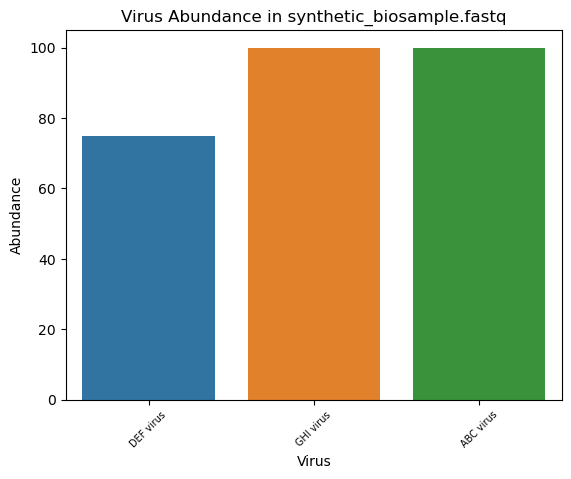
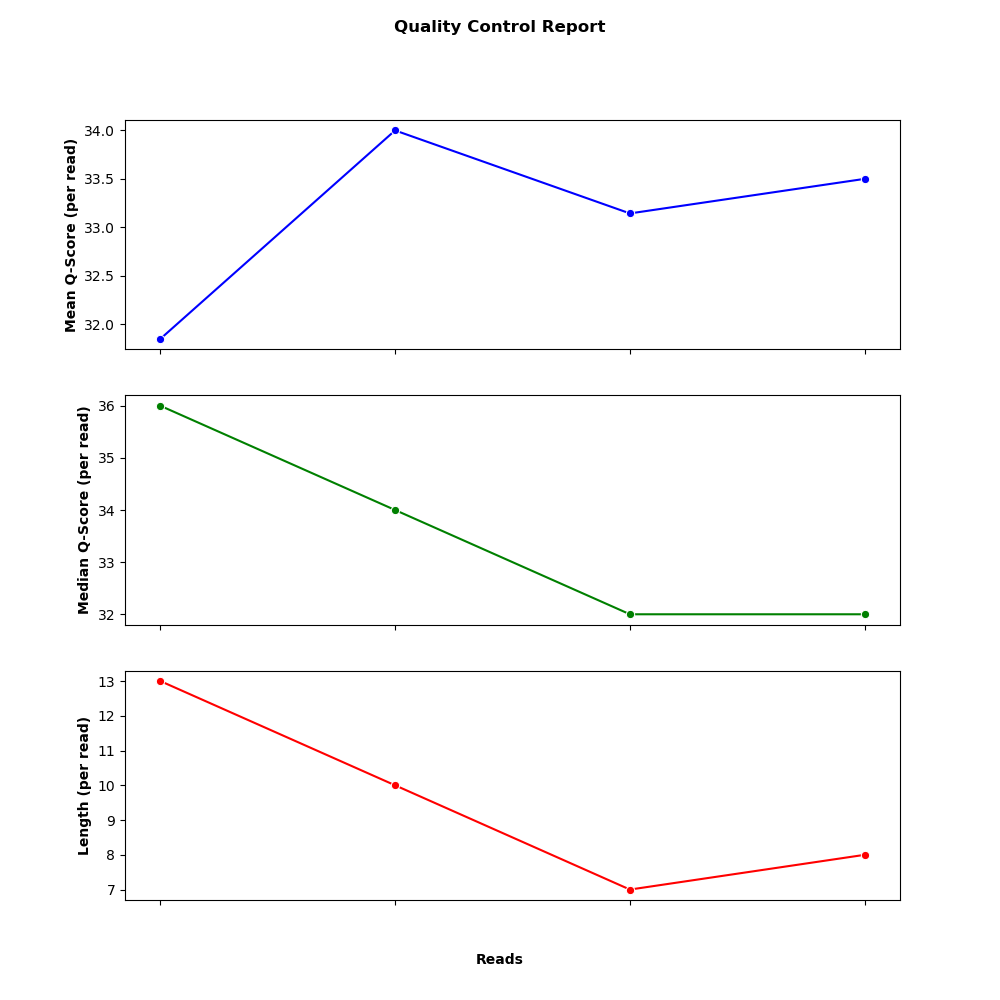

# CPBS Prelims Day 3
> Metagenomic Sequence Assembler and Virome Characterizer 

**Goal:** Develop a general method for characterizing the viral communities in a metagenomic sample. The input to your method is a short-read fastq file containing sequences from a metagenomic sample. 

The outline of this project is as follows:
1. Read in the metagenomic sample (.fastq) and known viruses (.fasta) 
    - importBioSample.py
    - importVirus.py
2. Perform Quality Control on the metagenomic sample:
    - Convert existing quality control ascii values to a Phred score and perform pruning of low quality reads
    - qc.py
3. Break the metagenomic sample reads into k-mers (user defined)
    - readsToKmers.py
4. Create a de Bruijn Graph from the pool of metagenomic sample k-mers
    - deBruijnGraph.py
5. Create contigs via a Depth-First Search traverse across the de Bruijn Graph
    - createContigs.py
6. Search the contigs for substrings of the viral sequences
    - Three implementations exist: 

        a. Standard search string strategy
        - searchForViruses.py (__functional implementation, integrated in the current state of the pipeline__)

        b. Leverage a Smith-Waterman local alignment algorithm for aligning each contig against each virus 
        - searchForViruses_SW.py ~Non-functional, large execution time

        c. Improve the Smith-Waterman algorithm by implementing parallel processing (via the concurrent.futures module) 
        - searchForViruses_SW_PP.py ~ Non-functional, large execution time

**Note on Input files:** Expected file types of input files are .fastq. Each read should contain 4 lines of information:

- Line 1: Read id, expected id's should start with @, such as: @SRR24581281.1 
- Line 2: Read sequence: ACTGGATCTTCAG
- Line 3: Expected format: +SRR24581281.1 1 length=302
- Line 4: Quality Information, should be ascii characters, such as: AAAAA#EEEEEEE

## Installation

OS X & Linux:
1. Clone or download the repository.
2. Set up miniconda environment:
    - If miniconda is not installed on the local machine, please follow the steps outlined here before continuing: [Miniconda installation](https://docs.anaconda.com/free/miniconda/)
    - Once miniconda is installed, create the conda environment by copying this command into a shell (terminal) with an active base conda environment:
        ```sh
        conda env create -f conda_env.yml
        ```
    - Then activate the new conda environment:
        ```sh
        conda activate conda_env
        ```

## Usage example
1. Open a terminal and navigate to /src/:
```sh
cd src
```
2. Use the following command to run the project: 
```sh
python3 main.py [options]
```
Options:
- `-h, --help`: Show help menu
- `-biosample`: Metagenomic biosample file (required)
- `-k`: User defined size of the k-mers (required)

<br>
Example:

1. After navigating to src (cd src), run the following command:
```sh
python3 main.py -biosample synthetic -k 5
```
2. Let the program execute, you will see time stamps for each component. Such as:
```sh
Time Stamp: Reads to Kmers finished in 0.22631192207336426
Time Stamp: DeBruijn Graph finished in 0.1376938819885254
Time Stamp: Create Contigs finished in 22.05834698677063
```
3. Upon successful completion, a code and virome report will be generated under the /src/data/reports directory.
    - Code Report: Contains execution time information and assembly statistics
    - Virome Report: Contians viral abundace information, quality control information, and a shannon diversity index for the metagenomic sample
    - ViralAbundance.png: Contains the relative abundance of each virus in the metagenomic sample
    - QualityControl.png: This is a plot that contains information about the q-score's for each read in the sample (mean and median per sample) along with the length per read (after the quality control phase) in base pairs

Example Viral Abundace plot (generated from the command in step 1):


Example Quality Control plot (generated from the command in step 1):


## Requirements
- Python 3.9 or higher. 
    - This project was developed in python v3.11 and has been tested with python 3.9 thru 3.12.
- Miniconda (see Installation section for further instructions).
- macOS or Linux based operating system.
